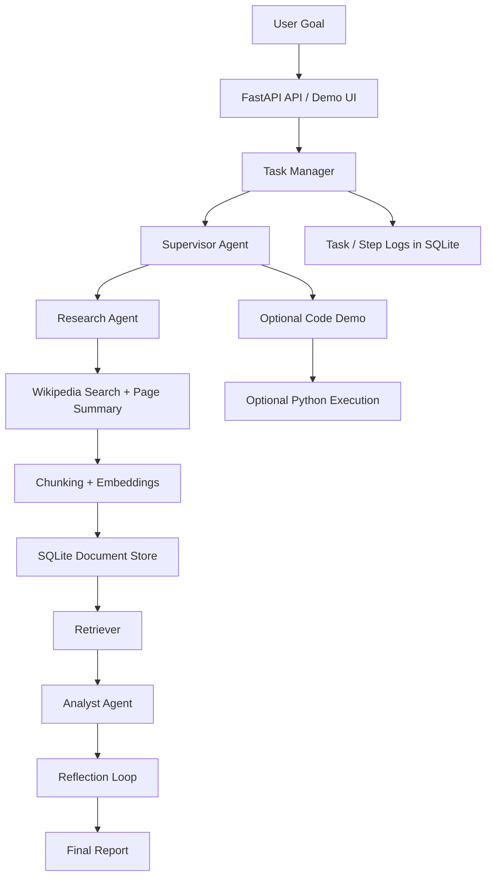

# Agentic Free RAG Ops

<p align="center">
  
  
  
  
  
  
</p>

A local-first **agentic research and reporting system** built with **FastAPI**, **Ollama**, and a lightweight **SQLite-backed RAG pipeline**.

The project accepts a high-level goal, plans a research flow, retrieves supporting context, synthesizes a report, runs a bounded reflection loop for quality, and stores the full task trace for inspection.

## Why this project is worth showcasing

This repository demonstrates a solid engineering pattern for **agentic AI systems that do not depend on paid APIs**:

- **Local LLM + local embeddings** via Ollama
- **Task orchestration** across multiple specialist agents
- **Retrieval-Augmented Generation (RAG)** with chunking, embeddings, and similarity search
- **Persistent execution logs** for tasks, steps, and ingested documents
- **FastAPI service layer** with a minimal browser UI for interactive testing
- **Optional code execution path** for generated Python demos

It is especially useful as a portfolio project for roles involving:

- AI/ML platform engineering
- applied LLM systems
- ML product backend development
- agent orchestration and RAG infrastructure

---

## What the system does

The current implementation follows this execution pattern:

1. **Accept a task goal** through the API or demo UI
2. **Supervisor agent** creates a short research plan and decides whether a code demo is useful
3. **Research agent** searches Wikipedia and ingests page summaries into the local RAG store
4. **RAG layer** chunks text, generates embeddings, and retrieves the most relevant passages
5. **Analyst agent** writes a report using only retrieved context
6. **Reflector agent** reviews the report and can request revisions
7. **Final output** is stored alongside step-level logs in SQLite

> **Current scope:** the default research workflow is **Wikipedia-first**, which keeps the project free to run and easy to reproduce locally.

---

## Architecture



---

## Core components

### 1. API layer
The backend is exposed through FastAPI and provides:

- `POST /v1/tasks` to create a task
- `GET /v1/tasks/{task_id}` to inspect progress and final output
- `/` to serve the lightweight demo UI

### 2. Agent orchestration
The orchestration layer coordinates multiple roles:

- **Supervisor** — converts a goal into short research queries
- **Researcher** — gathers source summaries
- **RAG / Retriever** — ranks the most relevant stored chunks
- **Analyst** — produces a structured markdown report
- **Reflector** — reviews the draft and requests revisions when needed
- **Coder** — optionally produces a Python demo script

### 3. Local RAG pipeline
The retrieval layer performs:

- whitespace normalization
- configurable chunking with overlap
- embedding generation via Ollama
- vector similarity scoring using NumPy
- retrieval of the top-k most relevant passages

### 4. Persistence layer
SQLite is used to persist:

- **tasks**
- **steps**
- **docs** (text chunks, metadata, and embeddings)

This makes the system easy to inspect, demo, and extend without adding external infrastructure.

---

## Repository structure

```text
agentic-free-rag-ops/
├── backend/
│   ├── app.py                # FastAPI entrypoint
│   ├── agent_system.py       # multi-agent orchestration
│   ├── db.py                 # SQLite schema and persistence helpers
│   ├── llm_ollama.py         # Ollama chat + embedding client
│   ├── models.py             # request/response models
│   ├── rag.py                # chunking, embeddings, retrieval
│   ├── tools_code.py         # optional Python execution helper
│   ├── tools_web.py          # Wikipedia + HTML fetch utilities
│   └── static/
│       ├── index.html        # minimal UI
│       └── app.js            # UI interaction + task polling
├── .env.example
├── requirements.txt
└── README.md
```

---

## Tech stack

- **Backend:** FastAPI, Uvicorn
- **Validation:** Pydantic
- **LLM runtime:** Ollama
- **Embeddings:** Ollama embeddings
- **RAG math:** NumPy
- **Persistence:** SQLite
- **HTTP + parsing:** Requests, BeautifulSoup, lxml
- **Frontend:** minimal static HTML + JavaScript

---

## Prerequisites

Before running the project, make sure you have:

1. **Python 3.10+**
2. **Ollama** installed locally
3. Required Ollama models pulled locally

Example:

```bash
ollama pull llama3
ollama pull nomic-embed-text
```

---

## Getting started

### 1. Install dependencies

```bash
pip install -r requirements.txt
```

### 2. Create your environment file

**Windows (PowerShell)**

```powershell
copy .env.example .env
```

**macOS / Linux / Git Bash**

```bash
cp .env.example .env
```

### 3. Review configuration

Default configuration is intentionally simple and local-first:

```env
OLLAMA_BASE_URL=http://localhost:11434
LLM_MODEL=llama3
EMBED_MODEL=nomic-embed-text
ENABLE_CODE_RUN=false
MAX_CODE_RUN_SECONDS=20
MAX_STEPS=6
RAG_TOP_K=5
RAG_CHUNK_SIZE=1200
RAG_CHUNK_OVERLAP=200
```

### 4. Start the API

```bash
uvicorn backend.app:app --reload --port 8000
```

### 5. Open the UI

Visit:

```text
http://localhost:8000
```

---

## API quickstart

### Create a task

```bash
curl -X POST http://localhost:8000/v1/tasks \
  -H "Content-Type: application/json" \
  -d '{
    "goal": "Compare 3 open-source vector databases and recommend one for small teams.",
    "max_steps": 6,
    "enable_code_run": false
  }'
```

### Example response

```json
{
  "task_id": "<uuid>",
  "goal": "Compare 3 open-source vector databases and recommend one for small teams.",
  "status": "queued",
  "created_at": "<timestamp>",
  "updated_at": "<timestamp>",
  "error": null,
  "steps": [],
  "result": null
}
```

### Check task status

```bash
curl http://localhost:8000/v1/tasks/<task_id>
```

The final response includes:

- task status
- step-by-step execution logs
- final synthesized report
- any execution error, if present

---

## Example use cases

This project works well for prompts such as:

- “Compare open-source vector databases and recommend one for a small team.”
- “Summarize a topic using evidence and provide risks + limitations.”
- “Generate a short technical report from locally retrieved sources.”
- “Create a local research assistant prototype without relying on external paid APIs.”

---

## Safety and current limitations

This project is strong as a **portfolio / educational system**, but it is not yet production hardened.

### Current limitations

- **Research sources are currently Wikipedia-centric** in the main orchestration flow
- **Optional code execution is not a true sandbox** and should stay disabled for untrusted content
- **Authentication, quotas, and rate limiting are not implemented**
- **Observability is minimal** beyond persisted task and step logs
- **Distributed workers / queue infrastructure are not included**
- **The demo UI is intentionally lightweight** and meant for developer testing

### Important security note

If `ENABLE_CODE_RUN=true`, generated Python can be executed in a subprocess. This is useful for demos but should not be treated as secure sandboxing.

---

## What to improve next

I want to evolve this into a stronger production-style system, the next logical upgrades are:

- multi-source web retrieval beyond Wikipedia
- source attribution with richer citations
- async worker queue (Celery, RQ, Dramatiq, or background job system)
- authentication and access control
- better retry, timeout, and failure policies
- structured tracing / observability
- containerization and deployment manifests
- test coverage for agent prompts and retrieval behavior
- safer execution isolation for tool-using agents

---

## How is this project well-rounded

This repository shows that you can work across the full lifecycle of an applied AI system:

- backend API development
- local model integration
- agent coordination
- RAG data flow design
- persistence and state tracking
- developer-focused UI integration
- practical trade-offs between simplicity, cost, and extensibility

It is a good example of a project that sits between **ML engineering**, **LLM systems**, and **product-minded backend development**.

---

## Recommended GitHub profile polish

To make the repository look even stronger on GitHub, consider adding:

- a short **repository description**
- GitHub **topics/tags** such as `rag`, `ollama`, `fastapi`, `agentic-ai`, `llm`, `sqlite`
- a **LICENSE** file
- a few **screenshots or a short demo GIF**
- a **sample output** section showing one completed task

---

## Disclaimer

This project is best understood as a **local, reproducible agentic RAG prototype** designed for learning, experimentation, and portfolio presentation.

It is intentionally lightweight, cost-conscious, and easy to run — which makes it a strong foundation for future production-grade extensions.
